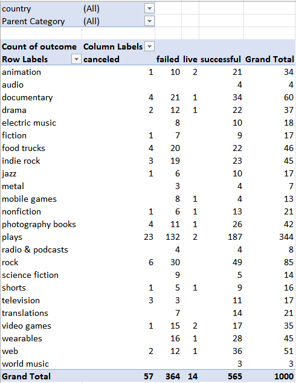
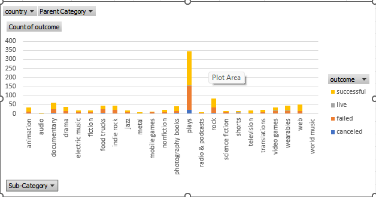
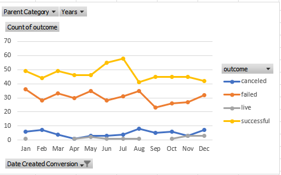
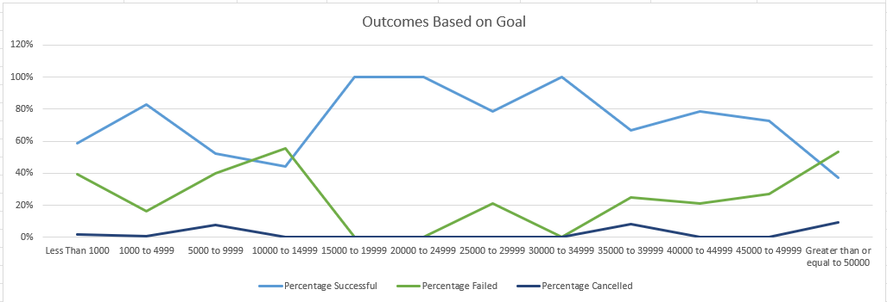

# Module 1 Challenge: Crowdfunding Analysis

<ins> Project Overview</ins>

The goal of this project is to organize and analyze a database of previous crowdfunding projects to discover any trends or aspects that will ensure the success of future projects. Since this project focuses on the data in an Excel file, I use Excel VBA to conduct my analysis.

<ins>Processes and Technologies</ins>
I first wish to modify and analyze the sample-project data and try to uncover market trends. First, I focus on the outcomes of the previous projects by color coding the success or failure and creating a pivot table that counts how many campaigns were successful, failed, cancelled or currently live per category and can be filtered based on country. I repeat this for the outcomes per sub-category. Lastly, I converted the `deadline` and `launched_at` columns from Unix timestamps to a Excel's date format using this formula `=(((A1/60)/60)/24)+DATE(1970,1,1)` and created a pivot table and line graph to show values based on the count of `outcome`, and filters based on `parent category` and `Years`.

From this analysis, I was able to answer the following questions:
* Given the provided data, what are three conclusions that we can draw about crowdfunding campaigns?
  * From this data we can learn that crowdfunding campaigns are the most popular with plays and rock music because these areas have the highest number of successful campaigns. We can also learn that June and July are the best months to create a campaign because those months have the highest number of successful campaigns. Lastly, we can learn that the least successful campaigns are in the areas of radio & podcasts, world music and mobile games because they have the lowest success rate. 
* What are some limitations of this dataset?
  * Some limitations of this dataset would be that it is not large enough to cover all the categories or subcategories that people might be interested in. It is also limited by the fact that we don’t know how the project sizes compare over time.
* What are some other possible tables and/or graphs that we could create, and what additional value would they provide?
  * We could use a pie chart to show the distribution of categories or parent categories or we could also utilize a scatterplot with a trendline to show the trends in the successful or failed campaigns.

<ins>Challenges</ins>
While I was able to complete most of the asks for this challenge, I struggled with being able to code in the added columns. I tried several variations of the formulas and ended up hard coding in the Category and Subcategory columns. After reviewing the VBA documentation online and reaching out to my TA for support, I have a better understanding of how to complete this task.
